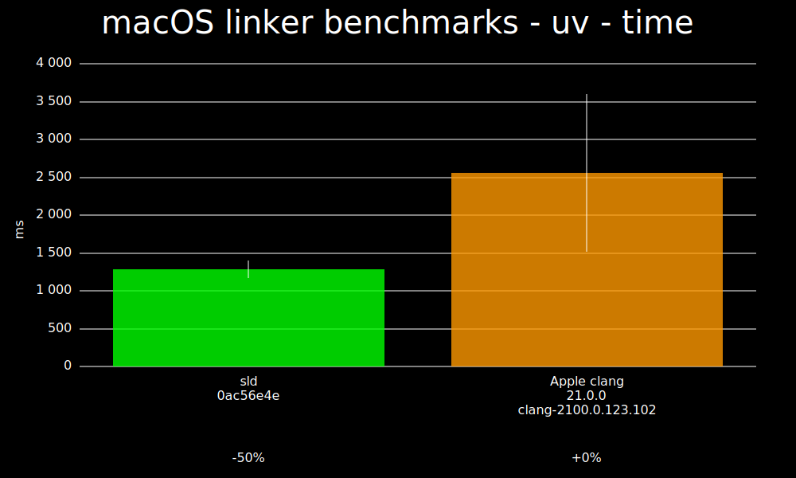
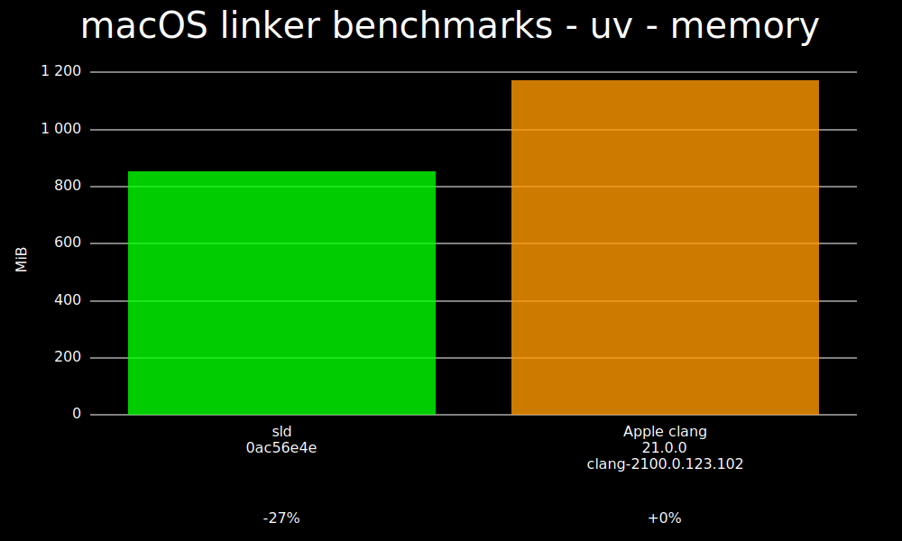

# macOS linker benchmarks

These native macOS benchmarks compare sld against Apple clang, which drives the system linker for
the same saved Mach-O link replay.

## Time

### uv - time

## Memory

### uv - memory

